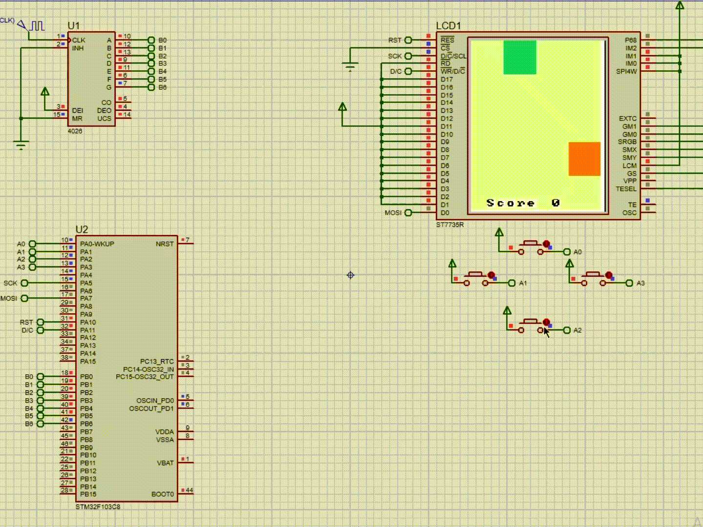

# STM32 Snake Game on TFT Display

## Overview
This project implements a classic Snake game on an STM32 Blue Pill microcontroller, displayed on a TFT screen. The game is controlled using physical buttons connected to GPIO pins and uses external interrupts for responsive gameplay. Communication with the TFT display is managed through the SPI peripheral. 

The game features two unique display modes and five levels of difficulty, each with dynamic changes in the snake's size and speed for increased challenge.

## Features
- **Platform**: STM32 Blue Pill (STM32F103C8T6)
- **Display**: TFT screen
- **Control**: Physical buttons
- **Peripherals Used**:
  - GPIO for button inputs
  - External interrupts for responsive control
  - SPI for TFT display communication

### Display Modes
1. **CohesiveAndStylish**: A smooth, harmonious color theme designed for a relaxed gameplay experience.
2. **ModernLook**: A sleek, contemporary design that provides a fresh visual style.

### Game Levels and Difficulty
The game includes five levels of difficulty, which adjust both the speed and size of the snake. As the difficulty level increases:
- **Snake Size**: The initial size of the snake decreases, making it harder to control and lengthen.
- **Snake Speed**: The snake’s speed increases, requiring faster reaction times and adding to the challenge.

These adjustments make higher levels more challenging, as players must navigate a smaller, faster-moving snake.

## How It Works
1. **Game Start**: The game starts with the snake on the screen, controlled via buttons.
2. **Gameplay**: Players navigate the snake to collect food blocks while avoiding collisions with walls and itself. Each food item collected increases the snake’s length and score.
3. **Difficulty and Display Modes**: Players can select a difficulty level and switch between CohesiveAndStylish and ModernLook display themes to change the visual appearance of the game.

## Project Structure
- **Code**: Written in C, leveraging STM32 HAL libraries for handling peripherals.
- **Hardware Connections**:
  - **Buttons**: Connected to GPIO pins with external interrupts enabled for responsive input handling.
  - **TFT Display**: Controlled via SPI communication for efficient graphics rendering.

## Getting Started
1. **Hardware Setup**:
   - Connect the TFT display to the STM32 Blue Pill via SPI.
   - Connect buttons to the designated GPIO pins (refer to the code for specific pin assignments).
2. **Code Compilation**:
   - Use an IDE like STM32CubeIDE or Keil to compile and upload the code to the STM32 Blue Pill.
3. **Run the Game**:
   - Upon powering the STM32, the game initializes, and you can start controlling the snake using the buttons.

## Future Enhancements
- Adding more complex game levels and obstacles.
- Implementing additional display themes for more variety.

## Demo

The above GIF shows the game in action, demonstrating different display modes and levels of difficulty.
